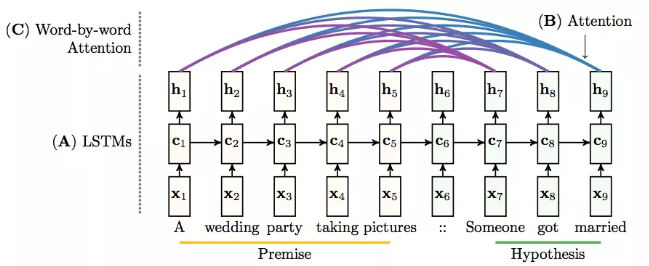
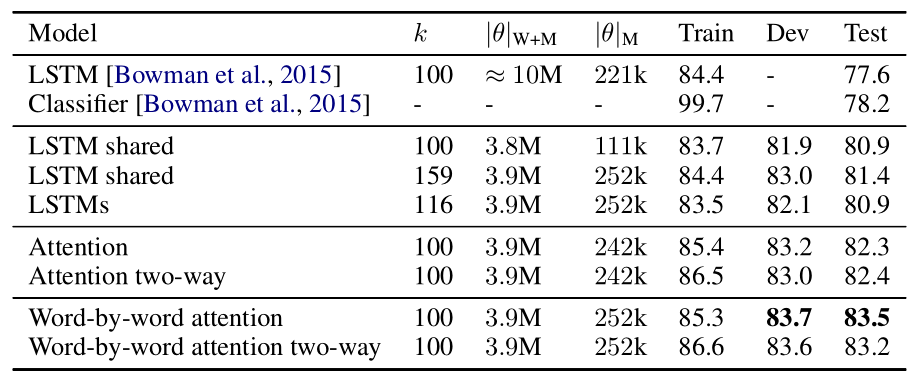

### Reasoning about Entailment with Neural Attention 论文总结

#### 写在前面

Attention mechanism 作为一种模型效果提升的方法，再很多领域都有应用，这篇论文也算是学习 Attention mechanism的经典论文之一，文中提出了一种 Attention based 的神经网络模型，用于文本蕴含推理，并取得state-of-art 的结果（当时）。

文中最主要的模型是建立 word-by-word  Attention 模型，与之做对比的还有几个模型，像基础的 LSTM 模型以及更深一步的双向Attention 等等，具体来说，就是这四个模型（当然提到了不止这四种，也可以理解更多个，像LSTM那部分就可以拆开来看，不过大部分是背景板。。问题不大）：

- 第一个模型实际上就是之前常见的文本蕴含推理的方式，首先使用一个 LSTM 处理 premise，然后将 最后的状态作为第二个 LSTM 的输入，然后处理 hypothesis ，最后输出的向量作为分类的依据这在文中 2.1，2。2节介绍。
- 第二个模型是加入Attention 的模型，这里的 Attention 建立在整个文本层面，在2.3节中介绍。
- 第三个是文中主要的模型，也是最后证明效果最好的模型，我理解是逐字注意力机制模型，在2.4节中介绍。
- 最后是第三个模型的改版，只是改成了双向的 Attention，但是实验中证明这样做反而结果下降了，在2.5节中介绍。

个人觉得这篇论文最好的一部分是实验环节，从实验部分可以看到很多设计对比试验的很多tricks，像应该从什么角度挑选有说服力的例子等等。

以下为个人理解和总结，欢迎指正~

#### 1. Abstract & Introduction

按照惯例，这一部分对全文的工作做了一个基本的概括。论文中提到，自动的文本蕴含识别一直以来都是依靠手工特征工程，端到端的神经网络模型在这一问题上都失败了，论文提出了一种基于LSTM的神经网络模型，同时处理两个句子来判断它们之间的蕴含关系，并且使用了 Attention machanism 来改进模型。

在 Introduction 部分，对文本蕴含识别（Recognizing textual entailment， RTE）任务作了介绍，对于两个文本，这种蕴含关系判断实际上就是判断三种关系：

- Neutral （不相关）
- Contradiction（矛盾）
- Entailment （蕴含）

并且这一任务在很多NLP任务中都有应用（例如信息提取，关系提取，机器翻译，文本自动摘要等等）

此外，这一部分还提到了关于这一任务的一个重要因素：数据集质量，SNLI数据集的质量相较之前提高了很多，这也是文中模型效果更好地一个原因。

这一部分最后提到了论文的三个贡献：

- 提出了一个基于LSTM的模型来处理文本蕴含任务
- 使用 word-by-word 的 Attention mechanism 来改进模型
- 详细定性分析了实验结果

#### 2. Methods

这部分实际上划分了四个模型，开始部分介绍了 LSTM单元的计算过程，然后接下来是四种模型分别介绍，四种结构都在图中展示，也就是文中 Figure 1：

##### 2.2 RTE with LSTMs

这一部分介绍了如何使用 LSTM 构建RTE任务的神经网络模型，这里提到，之前的模型都是分别建立两个文本的稠密向量表示（encding the premise and hypothesis as dense vectors, 我们在很多论文中都会看到 premise 和 hypothesis，这只是两个文本的惯称，就像输入输出一样），然后将这两个向量做一个 concatenate ， 然后输入到一个 MLP 网络中，然后通过这个网络进行分类。总之，这个过程就是先得到两个文本的表示向量，然后再进行分类任务。再之后的改进就是不单独处理两个文本，而是像一个序列一样处理，也就是第一个模型，先处理 premise， 然后最后一个隐状态作为第二部分的输入状态，这样最后输出的向量作为分类依据。

关于这个模型，有几点说明：

- 图中实际上有两个 LSTM 结构，C1-C5 是第一个 LSTM， C6-C9 是第二个
- 第一个 LSTM 结构处理完 premise 之后，最后的隐状态直接作为第二个 LSTM 结构的初始隐状态
- 使用的词向量为 word2vec，在训练过程中不进行调整，这里不进行调整的原因在文中做了解释，这样处理是为了在 inference 的时候，如果出现OOV，但是在 word2vec 词表存在的单词，仍然能保持近似（这里有点绕，其实就像是一视同仁，公平对待一样）
- 对于 OOV（out of vocabulary）的单词，采用随机初始化的方法

最后，这个结构输出的是一个联合表示 premise 和 hypothesis 的向量，然后使用一个 softmax 层对输出结果进行分类。

##### 2.3  Attention

这一小节介绍了第一种应用 Attention mechanism 的模型，也就是第二个模型，因为最终的目标是判断两个句子之间的关系，并不像机器翻译中要生成一个个单词， 所以实际上这里是对 hypothesis整体 与之前 premise 建立注意力机制（**这个地方有点绕：类比机器翻译，假设我们的 hypothesis 有三个词（ABC），那么我们会 A-premise， B-premise, C-premise分别建立注意力，但是这里，我们相当于不对hypothesis逐个单词与premise建立注意力，实际上，文中后面会提到，就是使用 hypothesis 最后一个状态与 premise 建立注意力，注意图中 B 表示的就是这个模型，B指向的箭头也就是 hypothesis 的最后一个状态）**

##### 2.4 word-by-word attention

这里介绍第三个模型结构，实际上是打破了上面第二个模型的只使用 hypothesis 最后一个状态与 premise 建立注意力的规则，这个模型实际上就与机器翻译中使用的注意力一致了，也就是对于 premise 和 hypothesis 的每个单词都建立注意力，看图中 C，也就是展示了这个过程，主要是上面的连线，把他们想想成有箭头单项（从hypothesis 方向指向 premise）也就是 word-by-word 的来历了。具体可以参考公式计算。

##### 2.5 two-way attention

这里在文中提到， 来源于 BiLSTM 的想法，也就是相当于两个方向上建立注意力， 首先是 hypothesis 中每个单词对 premise 建立注意力，然后反过来，premise 中每个单词对  hypothesis 建立，所以称为 “two-way”，但是后面会看到，实验证明这种方式效果并不好。

#### Experiments

 首先第一部分介绍了 SNLI 数据集的一些基本情况，这个数据集相对于之前的数据集无论是数量级还是质量都有了提升，此外这一部分还介绍了论文模型所采用的优化算法以及一些参数设置。

#### Result and Discussion

这一章有两部分内容，首先对四种模型的实验结果做了介绍，或者可以说是定量分析，第二部分是定性分析，这也就是之前文中提到的本文贡献之三。

##### 定量分析

首先是对各种模型的实验结果的简要分析，就是文中的 Table 1：

在开始的介绍中可以学到一些设计对比实验的技巧吧算是，比如作者在文中强调了实验参数量保持一致等等，就比如第一个LSTM模型是随着数据集的模型，算是一个基准模型，它的参数量是 10M， 相比之下其他的模型都要少很多，主要是这个模型在训练过程中会对词向量也进行微调（fine-tuning），后面会提到，实际上对词向量微调反而会使模型效果下降，第二个 Classifer 是一个从特征工程角度的模型，总之，第一行的两个模型是背景板。

再来看第二行中的三个模型，这对应于文中加重的 LSTM 部分，其中 ‘shared’ 的模型是指使用一个 LSTM 处理 premise 和 hypothesis  ，也就是参数共享？，最后一个 LSTMs 则是两个 LSTM 分别处理 premise 和 hypothesis， 这三个模型除了结构上不同，还有就是 K ，也就是隐层神经元的数量不同，可以看到效果显然比背景板的两个模型要好，这里要提一下背景板的 LSTM 模型是分别对 premise 和 hypothesis 进行encode，然后再进行之后的处理，而下面的三个模型都是两个文本一块处理，文中给出的原因是，不分别进行处理的话，是的一个文本的信息可以流向另一个文本的表示，另外这部分也提到了词向量微调的问题，文中给出的原因是微调可能会使得模型产生一定的过拟合问题。其实，我倒是觉得这里的 LSTMs 是对下面的 attention 系列模型的对比，这样更合适，因为下面的模型都是基于使用两个 LSTM 的。

第三行的 Attention 模型，这是一般的注意力机制，也就是我在上面 2.3 部分所说的那样，文中提到，加入 Attention 后的模型可以总结 premise 的上下文特征，这里的解释其实就是一般注意力机制的优点了。

最后是文中提出的模型 ：逐字注意力的模型，可以看到，单项的逐字注意力模型效果最好，这里解释双向逐字地注意力模型效果不好因是因为 premise 和 hypothesis 的关系不是对称的，因此这样的结果会产生一些噪声，从而结果反而不好。

##### 定性分析

这一部分的图表做的是真的很好看，用这种图表示 Attention 是真的很直观了，这里通过这种可视化的方式对 普通的Attention以及 word-by-word Attention 进行了分析。

首先看第一部分介绍一般的 Attention 机制的使用，就像之前提到的，这里实际上是对 hypothesis 整体的表示和 premise 建立联系，从 Figure 2 中看的更清楚也就是看看 hypothesis 和 premise 中那些词更有联系，在之前总的结构图中我们看到这里实际上 hypothesis 的表示实际上就是最后一个隐状态。

对于 word-by-word  Attention ，从 Figure 3 中可以看出，是对 premise 和 hypothesis 的单词对之间建立联系，这里论文中提到了一些现象，可以很轻松的检测仅仅重构了顺序的句子（3a中可以看出来），以及可以检测到同义词和多个单词对应一个单词的情况，也可以处理更深层的语义句子。这里也提到了 Attention 失效的情况，那就是两个文本完全不相关的时候。

#### Conclusion

结论部分简单总结了工作以及未来工作的方向，不再赘述。